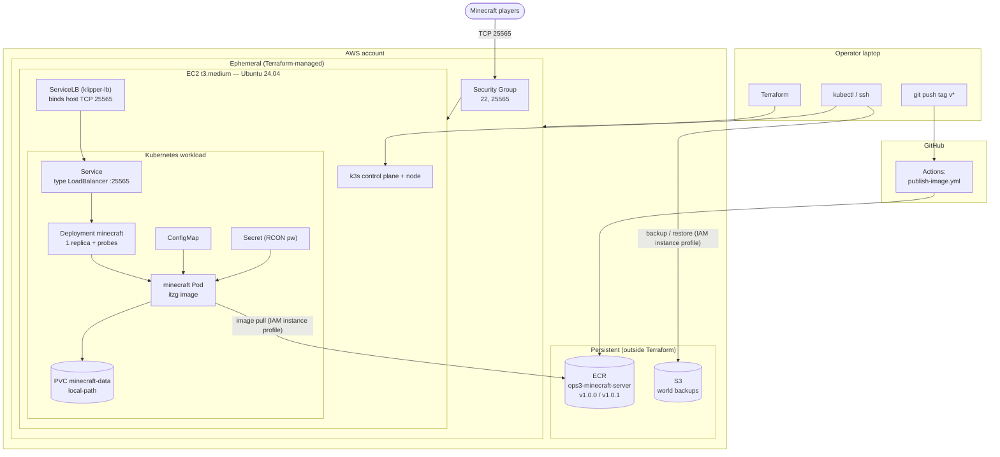

# Ops 4: Container Orchestration — Architecture and Operations Documentation

**Name:** Cody Strehlow | **OSUID:** 934609212 | **ONID:** strehloc

[Link to narrated screen recording](https://media.oregonstate.edu/media/t/1_tuv8ys85)

[Link to GitHub repository](https://github.com/Codystray/cs312-ops4)

**Screen recording timestamps** (submit alongside the video):

---

## Table of Contents

1. [Scope and What Changed From Ops 3](#1-scope-and-what-changed-from-ops-3)
2. [Architecture Overview](#2-architecture-overview)
3. [Architecture Diagram](#3-architecture-diagram)
4. [Tradeoff Notes](#4-tradeoff-notes)
5. [Repository File Map](#5-repository-file-map)
6. [Provisioning: Terraform](#6-provisioning-terraform)
7. [Bootstrap: Installing k3s on the Host](#7-bootstrap-installing-k3s-on-the-host)
8. [Private Registry Access (ECR)](#8-private-registry-access-ecr)
9. [Kubernetes Manifests](#9-kubernetes-manifests)
10. [Deploying the Server](#10-deploying-the-server)
11. [Service Exposure on 25565](#11-service-exposure-on-25565)
12. [Persistence and Backup/Restore](#12-persistence-and-backuprestore)
13. [Rollout and Rollback](#13-rollout-and-rollback)
14. [Failure Drill](#14-failure-drill)
15. [Operator Procedures](#15-operator-procedures)
16. [Cost Controls](#16-cost-controls)
17. [Teardown Checklist](#17-teardown-checklist)

---

## 1. Scope and What Changed From Ops 3

Ops 3 ran Minecraft as a single Docker container managed by the Docker daemon, configured by Ansible. Ops 4 migrates that same workload onto Kubernetes (k3s): the artifact chain (ECR image), the world data, and the S3 backup pattern are preserved, while declarative rollout, rollback, health, and recovery controls are added.

| Concern | Ops 3 (Docker) | Ops 4 (k3s) |
|---|---|---|
| Runtime | `docker run` via Ansible | k3s Deployment |
| Restart on crash | `restart_policy` | Deployment control loop |
| Configuration | Container `env` in playbook | ConfigMap + Secret |
| World data | Host bind mount `/opt/minecraft/data` | PVC on `local-path` StorageClass |
| Exposure | Docker port `25565:25565` | LoadBalancer Service on 25565 (k3s ServiceLB) |
| Health | None | Startup, liveness, and readiness probes |
| Resource control | None | Requests + limits |
| Updates | Edit tag, re-run Ansible | `kubectl set image` / `kubectl rollout undo` |
| Host configuration | Ansible | k3s install (no Ansible in Ops 4) |

**Carried over unchanged:** the ECR repo `ops3-minecraft-server` and its image (referenced by pinned tag, never `latest`); the S3 bucket `ops3-minecraft-backups-413777480403` (private, versioned, 7-day lifecycle); the `LabInstanceProfile` IAM profile, which provides both ECR pull authentication and S3 backup access with no hardcoded credentials; the GitHub Actions workflow `publish-image.yml`.

---

## 2. Architecture Overview

| Property | Value |
|---|---|
| Cloud provider | AWS (Academy Learner Lab) |
| Provisioning | Terraform (AWS provider `~> 5.0`) |
| Orchestrator | k3s (single-node Kubernetes) |
| Workload controller | Deployment (single replica) + PersistentVolumeClaim |
| Instance | `t3.medium` (2 vCPU, 4 GiB RAM) |
| OS | Ubuntu 24.04 LTS |
| Root volume | 20 GiB gp3 |
| IAM | `LabInstanceProfile` (contains `LabRole`) |
| Image | `<acct>.dkr.ecr.us-east-1.amazonaws.com/ops3-minecraft-server` |
| Pinned tags | `v1.0.0` (baseline), `v1.0.1` (rollout target) |
| Minecraft version | 1.21.1 (via `VERSION` env var) |
| World data | PVC `minecraft-data`, `local-path`, 2 GiB |
| Backup bucket | `ops3-minecraft-backups-413777480403` |
| Exposure | LoadBalancer Service, TCP 25565, bound on the host by k3s ServiceLB |
| MOTD | `strehloc's minecraft server` |

**Security Group inbound rules (minimal, per assignment constraint):**

| Port | Source | Purpose |
|---|---|---|
| 22 | `var.ssh_allowed_cidr` (your IP `/32`) | SSH administration, restricted to a known source |
| 25565 | `0.0.0.0/0` | Minecraft player connections |

No other ports are open. Players connect to `<public-ip>:25565`, the standard Minecraft port.

---

## 3. Architecture Diagram



- **Operator laptop** runs Terraform (provisioning) and `kubectl`/`ssh` (operations). A `v*` git tag push triggers the image pipeline.
- **GitHub** builds and pushes a new pinned image tag to ECR on a tag push.
- **AWS** holds persistent resources (ECR, S3, outside Terraform, survive `destroy`) and ephemeral resources (EC2, Security Group, Terraform-managed). The host runs k3s; ServiceLB binds the LoadBalancer Service's port 25565 directly on the host. The Pod pulls its image from ECR and stores world data on a PVC backed by the host disk. ECR and S3 access both use the EC2 instance profile, with no hardcoded credentials anywhere.

---

## 4. Tradeoff Notes

**Workload controller: Deployment + PVC.** The assignment accepts either a Deployment with a PVC or a StatefulSet for a single-replica stateful service. A Deployment + PVC is chosen because it is the closest one-to-one migration of the Ops 3 single-container deployment and keeps the manifest set minimal. A Minecraft server holds an exclusive lock on its world files and cannot run as multiple interchangeable replicas, so the Deployment runs exactly `replicas: 1` with `strategy: Recreate` — the old Pod is fully terminated before the new one starts, guaranteeing the world directory is never mounted by two Pods at once. The cost is roughly 30–60 seconds of downtime per update while the new Pod starts and the world loads; this is acceptable for a non-critical Minecraft server and is the honest behavior of a single-writer workload. A StatefulSet would also be valid but adds `volumeClaimTemplates` indirection that complicates the backup/restore path for no benefit at a single replica.

**Persistence: PVC on the `local-path` StorageClass.** The container's writable layer is discarded on every Pod replacement (rollout, crash, reboot), so world data must live on a volume. k3s ships the `local-path` StorageClass, which provisions a PersistentVolume backed by a directory on the node's local disk. Mounted at the container's `/data`, it keeps the world independent of any Pod. The tradeoff relative to a cloud-managed volume (such as an EBS-backed CSI volume) is that `local-path` ties the data to one specific node's disk: it survives Pod deletion and node reboot, but not destruction of the EC2 instance, since the disk goes with the instance. On a single-node cluster there is only one node, so the node-affinity limitation is moot; the instance-destruction gap is covered by the S3 backup (Section 12). For this single-node assignment `local-path` is sufficient and is the approach the assignment hints endorse.

**Service exposure: LoadBalancer on 25565.** Minecraft uses a raw TCP protocol, not HTTP, so an Ingress (which routes HTTP by hostname and path) cannot carry it. The assignment directs the single-node k3s path to a `LoadBalancer` Service so k3s's bundled ServiceLB (klipper-lb) binds the service port directly on the host. This exposes Minecraft on the real port 25565 with no high-numbered NodePort visible to players. NodePort and hostPort are explicitly excluded by the assignment as the primary path; LoadBalancer + ServiceLB is the intended single-node exposure mechanism.

**Probes: startup + liveness + readiness, all `tcpSocket` on 25565.** Minecraft exposes no HTTP health endpoint. A TCP socket probe against port 25565 is the accepted baseline: it confirms the server is accepting connections. Its limitation, stated honestly, is that an open TCP port is weaker evidence than true application readiness — the port can be open a moment before the world is fully playable. A **startup probe** handles the slow JVM warmup: Minecraft can take 30–60+ seconds to generate or load a world, and the startup probe gives it up to roughly 5 minutes to first answer on 25565 before liveness checks begin, which prevents a restart loop during a slow start. Once the startup probe passes, the **liveness probe** restarts the container if the server later stops accepting connections (a hung JVM), and the **readiness probe** keeps the Pod out of the Service's endpoints until it is accepting connections. Splitting startup from liveness is what makes the conservative startup window safe without weakening the liveness check afterward.

**Instance sizing: `t3.medium`.** (4 GiB) gives the k3s control plane and the JVM comfortable room to coexist on one node. The cost difference at single-server, single-session scale is small and is justified by the stability headroom; see Section 16.

**Resource requests and limits.** The JVM heap is fixed at 1 GiB (`MEMORY: "1G"`, carried from Ops 3, grounded in the Paper documentation). Real container memory is heap plus non-heap JVM memory plus the base image, which sits above 1 GiB. The request `1.25Gi` reserves enough for the scheduler to place the Pod with room for the k3s control plane alongside it; the limit `1.75Gi` caps the container so a memory leak cannot starve k3s itself (exceeding it triggers an OOM kill, which the Deployment then recovers from). CPU request `500m` reflects steady-state load; the limit `1500m` permits bursts during world generation on the 2-core node.

---

## 5. Repository File Map

All submitted automation and configuration, by path in the repository:

| Path | Purpose |
|---|---|
| `terraform/main.tf` | Provisions the Security Group and EC2 host that runs k3s |
| `terraform/variables.tf` | Input variables (key pair, SSH CIDR, instance type, backup bucket) |
| `terraform/outputs.tf` | Outputs (public IP, SSH command, Minecraft endpoint, ECR/S3 references) |
| `terraform/terraform.tfvars` | Operator's real values — gitignored, not submitted |
| `k8s/minecraft-secret.yaml` | Secret holding the RCON password |
| `k8s/minecraft-config.yaml` | ConfigMap holding non-sensitive server configuration |
| `k8s/minecraft-pvc.yaml` | PersistentVolumeClaim for world data |
| `k8s/minecraft-deployment.yaml` | Deployment: the Minecraft workload, probes, resources |
| `k8s/minecraft-service.yaml` | LoadBalancer Service exposing TCP 25565 |
| `scripts/backup.sh` | World backup script (snapshot to S3) |
| `.github/workflows/publish-image.yml` | CI pipeline: builds and pushes the ECR image on a `v*` tag |
| `.gitignore` | Excludes tfstate, `*.pem`, `terraform.tfvars` |
| `RUNBOOK.md` | This document |

The k3s install and the `registries.yaml` ECR configuration (Sections 7–8) are run by hand on the host and are documented here rather than committed as code, because they contain host-specific paths and a short-lived token.

---

## 6. Provisioning: Terraform

Terraform provisions the compute layer only (Security Group + EC2). ECR and S3 stay outside Terraform as data sources, so `destroy` never touches the image or backups. This is the Ops 3 `terraform/` directory with one change: the Ops 3 Ansible `null_resource` plus `local_file` inventory are removed (Ops 4 has no Ansible). The AMI lookup and the Security Group’s port 25565 are unchanged from Ops 3.

### 6.1 `terraform/main.tf`

```hcl
terraform {
  required_providers {
    aws = {
      source  = "hashicorp/aws"
      version = "~> 5.0"
    }
  }
}

provider "aws" {
  region = "us-east-1"
}

data "aws_vpc" "default" {
  default = true
}

data "aws_subnets" "default" {
  filter {
    name   = "vpc-id"
    values = [data.aws_vpc.default.id]
  }
}

resource "aws_security_group" "minecraft" {
  name        = "ops4-minecraft-sg"
  description = "SSH and Minecraft access for the Ops 4 k3s host"
  vpc_id      = data.aws_vpc.default.id

  ingress {
    description = "SSH (administrative access, restricted to a known source)"
    from_port   = 22
    to_port     = 22
    protocol    = "tcp"
    cidr_blocks = [var.ssh_allowed_cidr]
  }

  ingress {
    description = "Minecraft"
    from_port   = 25565
    to_port     = 25565
    protocol    = "tcp"
    cidr_blocks = ["0.0.0.0/0"]
  }

  egress {
    from_port   = 0
    to_port     = 0
    protocol    = "-1"
    cidr_blocks = ["0.0.0.0/0"]
  }

  tags = {
    Name = "ops4-minecraft-sg"
  }
}

# Persistent resources, managed outside Terraform (created via AWS CLI in Ops 3).
# Read as data sources so terraform destroy never removes the image or backups.
data "aws_ecr_repository" "minecraft" {
  name = "ops3-minecraft-server"
}

data "aws_s3_bucket" "backups" {
  bucket = var.backup_bucket
}

# Ubuntu 24.04 LTS AMI. Owner 099720109477 is Canonical.
# Same dynamic lookup as the Ops 3 Terraform; known-good.
data "aws_ami" "ubuntu" {
  most_recent = true
  owners      = ["099720109477"]

  filter {
    name   = "name"
    values = ["ubuntu/images/hvm-ssd-gp3/ubuntu-noble-24.04-amd64-server-*"]
  }

  filter {
    name   = "architecture"
    values = ["x86_64"]
  }

  filter {
    name   = "state"
    values = ["available"]
  }
}

resource "aws_instance" "minecraft" {
  ami                    = data.aws_ami.ubuntu.id
  instance_type          = var.instance_type
  key_name               = var.key_name
  vpc_security_group_ids = [aws_security_group.minecraft.id]
  iam_instance_profile   = "LabInstanceProfile"

  root_block_device {
    volume_size = 20
    volume_type = "gp3"
  }

  tags = {
    Name = "ops4-minecraft"
  }
}
```

### 6.2 `terraform/variables.tf`

```hcl
variable "key_name" {
  description = "Name of an existing AWS EC2 key pair (e.g., ~/.ssh/cs312-key.pem)"
  type        = string
}

variable "ssh_allowed_cidr" {
  description = "CIDR block allowed to SSH to the instance. Set to your-ip/32."
  type        = string
  default     = "0.0.0.0/0"
}

variable "instance_type" {
  description = "EC2 instance type. t3.medium (4 GiB) gives the k3s control plane and the JVM comfortable headroom on one node."
  type        = string
  default     = "t3.medium"
}

variable "backup_bucket" {
  description = "Name of the externally-managed S3 bucket holding world backups."
  type        = string
}
```

### 6.3 `terraform/outputs.tf`

```hcl
output "instance_public_ip" {
  description = "Public IPv4 address of the k3s host"
  value       = aws_instance.minecraft.public_ip
}

output "instance_id" {
  description = "EC2 instance ID"
  value       = aws_instance.minecraft.id
}

output "ssh_command" {
  description = "Ready-to-paste SSH command (Ubuntu default user is ubuntu)"
  value       = "ssh -i ~/.ssh/cs312-key.pem ubuntu@${aws_instance.minecraft.public_ip}"
}

output "minecraft_endpoint" {
  description = "Address players connect to"
  value       = "${aws_instance.minecraft.public_ip}:25565"
}

output "ecr_repository_url" {
  description = "ECR repository URL (read from data source)"
  value       = data.aws_ecr_repository.minecraft.repository_url
}

output "backup_bucket_name" {
  description = "S3 bucket holding world backups (read from data source)"
  value       = data.aws_s3_bucket.backups.id
}
```

### 6.4 `terraform/terraform.tfvars` (gitignored)

```hcl
key_name         = "cs312-key"
ssh_allowed_cidr = "YOUR.PUBLIC.IP/32"
backup_bucket    = "ops3-minecraft-backups-413777480403"
```

Find your public IP: `curl -s https://checkip.amazonaws.com`.

### 6.5 Apply

```bash
cd terraform/
terraform init
terraform plan      # expect exactly 2 resources to add: SG + EC2
terraform apply
terraform output
```

Wherever a command below shows `<public-ip>`, substitute the `instance_public_ip` output.

---

## 7. Bootstrap: Installing k3s on the Host

Run once per fresh EC2 instance. Follows Lab 8's k3s procedure.

1. **SSH to the host** (Ubuntu default user is `ubuntu`):

   ```bash
   ssh -i ~/.ssh/cs312-key.pem ubuntu@<public-ip>
   ```

2. **Install the AWS CLI v2.** Ubuntu 24.04 does not ship the AWS CLI, and Section 8 (ECR authentication) and Section 12.3 (the S3 backup script) both call `aws` on the host. Install the official v2 (the `apt` package is the older v1):

   ```bash
   sudo apt-get update
   sudo apt-get install -y unzip
   curl -fsSL "https://awscli.amazonaws.com/awscli-exe-linux-x86_64.zip" -o /tmp/awscli.zip
   unzip -q /tmp/awscli.zip -d /tmp
   sudo /tmp/aws/install
   rm -rf /tmp/awscli.zip /tmp/aws
   ```

   Verify the CLI works and the instance profile is providing credentials:

   ```bash
   aws --version                  # expect aws-cli/2.x
   aws sts get-caller-identity    # expect your account ID, no keys configured
   ```

   `aws sts get-caller-identity` returning your account ID confirms the `LabInstanceProfile` is attached and working. If it errors, stop here and fix it before continuing — Section 8 depends on it.

3. **Create the k3s config directory.** k3s normally creates `/etc/rancher/k3s/` during install, but Section 8 writes `registries.yaml` into it *before* the install, so the directory must exist first:

   ```bash
   sudo mkdir -p /etc/rancher/k3s
   ```

4. **Configure ECR access before installing k3s** — go to Section 8 now and write `registries.yaml`. It must exist before k3s starts so containerd picks it up on first start. (If k3s is already installed, Section 8.2 covers the `systemctl restart k3s` reload path instead.)

5. **Install k3s** — downloads the binary, installs it as a systemd service, starts it, installs `kubectl`:

   ```bash
   curl -sfL https://get.k3s.io | sh -
   ```

6. **Configure `kubectl` without `sudo`:**

   ```bash
   mkdir -p ~/.kube
   sudo cp /etc/rancher/k3s/k3s.yaml ~/.kube/config
   sudo chown $(id -u):$(id -g) ~/.kube/config
   export KUBECONFIG=~/.kube/config
   echo 'export KUBECONFIG=~/.kube/config' >> ~/.bashrc
   ```

   > This copies the cluster-admin kubeconfig (equivalent to root on the cluster) to your home directory. Acceptable for a single-operator assignment; production uses scoped RBAC-backed kubeconfigs.

7. **Verify** — expect one node `Ready`; record the k3s version for the screen recording:

   ```bash
   kubectl get nodes -o wide
   ```

---

## 8. Private Registry Access (ECR)

The Minecraft image is in a **private** ECR repository, so k3s must authenticate before pulling. The EC2 host has AWS permissions through the `LabInstanceProfile` instance profile, so **no AWS keys are stored anywhere** — the AWS CLI obtains credentials from the instance metadata service automatically.

**Primary approach: node-level `registries.yaml`.** k3s reads `/etc/rancher/k3s/registries.yaml` to configure containerd's authentication for private registries. The host (using its instance profile) runs `aws ecr get-login-password` to obtain a short-lived ECR token and writes it into that file. This is a node-level approach that uses the IAM instance profile, with no hardcoded long-lived credentials. The ECR token expires after **12 hours**; refreshing it is a documented operator procedure (Section 15.4).

### 8.1 Write `registries.yaml`

Run on the EC2 host. The first two lines compute the registry URL from the instance profile; the heredoc writes the config file.

```bash
ACCOUNT_ID=$(aws sts get-caller-identity --query Account --output text)
ECR_REGISTRY="${ACCOUNT_ID}.dkr.ecr.us-east-1.amazonaws.com"

sudo tee /etc/rancher/k3s/registries.yaml > /dev/null <<EOF
configs:
  "${ECR_REGISTRY}":
    auth:
      username: AWS
      password: $(aws ecr get-login-password --region us-east-1)
EOF
```

### 8.2 Apply the configuration

- If k3s is **not yet installed**, install it now (Section 7 step 5); it reads `registries.yaml` on first start.
- If k3s is **already running**, restart it so containerd reloads the file:

  ```bash
  sudo systemctl restart k3s
  ```

### 8.3 Record the registry URL

You will paste this into the Deployment manifest (Section 9.4):

```bash
echo "${ECR_REGISTRY}/ops3-minecraft-server:v1.0.0"
```

---

## 9. Kubernetes Manifests

Create a working directory on the host and write five files. Commit all five to the repo under `k8s/`.

```bash
mkdir -p ~/minecraft-k8s && cd ~/minecraft-k8s
```

### 9.1 `minecraft-secret.yaml`

```yaml
apiVersion: v1
kind: Secret
metadata:
  name: minecraft-secret
type: Opaque
stringData:
  rcon-password: changeme-pick-your-own
```

`stringData` lets you write plain text; Kubernetes base64-encodes it on storage. Choose your own password; do not commit a real one. This Secret holds no AWS credentials — ECR and S3 access both come from the instance profile.

### 9.2 `minecraft-config.yaml`

```yaml
apiVersion: v1
kind: ConfigMap
metadata:
  name: minecraft-config
data:
  EULA: "TRUE"
  VERSION: "1.21.1"
  MEMORY: "1G"
  MOTD: "strehloc's minecraft server"
  ENABLE_RCON: "true"
  RCON_PORT: "25575"
```

These keys become container environment variables. `MOTD` carries the required student identifier; `VERSION` and `MEMORY` are unchanged from Ops 3.

### 9.3 `minecraft-pvc.yaml`

```yaml
apiVersion: v1
kind: PersistentVolumeClaim
metadata:
  name: minecraft-data
spec:
  accessModes:
    - ReadWriteOnce
  storageClassName: local-path
  resources:
    requests:
      storage: 2Gi
```

`ReadWriteOnce` is correct for a single writer. Status stays `Pending` until a Pod mounts it (`local-path` uses late binding), then becomes `Bound`.

### 9.4 `minecraft-deployment.yaml`

**Replace `<ECR_REGISTRY>` with the Section 8.3 value before applying.**

```yaml
apiVersion: apps/v1
kind: Deployment
metadata:
  name: minecraft
  labels:
    app: minecraft
spec:
  replicas: 1
  strategy:
    type: Recreate
  selector:
    matchLabels:
      app: minecraft
  template:
    metadata:
      labels:
        app: minecraft
    spec:
      containers:
        - name: minecraft
          image: <ECR_REGISTRY>/ops3-minecraft-server:v1.0.0
          ports:
            - containerPort: 25565
              name: minecraft
            - containerPort: 25575
              name: rcon
          envFrom:
            - configMapRef:
                name: minecraft-config
          env:
            - name: RCON_PASSWORD
              valueFrom:
                secretKeyRef:
                  name: minecraft-secret
                  key: rcon-password
          startupProbe:
            tcpSocket:
              port: 25565
            initialDelaySeconds: 20
            periodSeconds: 10
            failureThreshold: 30
          readinessProbe:
            tcpSocket:
              port: 25565
            periodSeconds: 10
            failureThreshold: 3
          livenessProbe:
            tcpSocket:
              port: 25565
            periodSeconds: 20
            failureThreshold: 3
          resources:
            requests:
              memory: "1.25Gi"
              cpu: "500m"
            limits:
              memory: "1.75Gi"
              cpu: "1500m"
          volumeMounts:
            - name: world
              mountPath: /data
      volumes:
        - name: world
          persistentVolumeClaim:
            claimName: minecraft-data
```

**Justification:**

- `replicas: 1` + `strategy: Recreate` — one writer for the world; the old Pod is fully stopped before the new one starts (Section 4).
- `image: ...:v1.0.0` — a pinned tag, never `latest`, as the assignment requires. No `imagePullSecrets` is needed because authentication is handled at the node level by `registries.yaml` (Section 8).
- `envFrom.configMapRef` injects every ConfigMap key as an environment variable; `RCON_PASSWORD` is the one sensitive value, pulled from the Secret.
- **Startup probe** — `tcpSocket` on 25565, with `failureThreshold: 30` × `periodSeconds: 10` after a 20 s initial delay, gives the server up to ~5 minutes to first accept a connection. Liveness and readiness do not run until the startup probe passes, so a slow world load cannot trigger a restart loop.
- **Readiness probe** — `tcpSocket` on 25565; keeps the Pod out of the Service endpoints until it accepts connections.
- **Liveness probe** — `tcpSocket` on 25565; after startup completes, restarts the container if the server stops accepting connections (a hung JVM).
- **Probe limitation (documented honestly):** a TCP socket check confirms the port is open, which is weaker evidence than true Minecraft application readiness — the port can be open a moment before the world is fully playable. Minecraft exposes no HTTP health endpoint, so `tcpSocket` is the accepted baseline.
- **Resources** — see Section 4. Request `1.25Gi`/`500m`, limit `1.75Gi`/`1500m`.
- `volumeMounts`/`volumes` — mounts the `minecraft-data` PVC at `/data`, where the itzg image stores the world.

### 9.5 `minecraft-service.yaml`

```yaml
apiVersion: v1
kind: Service
metadata:
  name: minecraft-service
spec:
  type: LoadBalancer
  selector:
    app: minecraft
  ports:
    - name: minecraft
      port: 25565
      targetPort: 25565
      protocol: TCP
```

`type: LoadBalancer` on single-node k3s triggers ServiceLB (klipper-lb), which binds port 25565 directly on the host. `selector: app: minecraft` ties the Service to the Deployment's Pod. RCON port 25575 is deliberately not exposed by the Service; RCON is reached only from inside the cluster via `kubectl exec` (Section 15.3).

---

## 10. Deploying the Server

1. **Apply all manifests:**

   ```bash
   cd ~/minecraft-k8s
   kubectl apply -f minecraft-secret.yaml \
                 -f minecraft-config.yaml \
                 -f minecraft-pvc.yaml \
                 -f minecraft-deployment.yaml \
                 -f minecraft-service.yaml
   ```

2. **Wait for the rollout** (1–3 min on first run: image pull + world generation):

   ```bash
   kubectl rollout status deployment/minecraft
   ```

3. **Verify cluster state:**

   ```bash
   kubectl get nodes
   kubectl get pods -o wide
   kubectl get svc minecraft-service
   kubectl get pvc minecraft-data
   ```

   Expected: node `Ready`; Pod `Running` / `1/1`; Service `minecraft-service` of type `LoadBalancer` with port `25565` and an `EXTERNAL-IP` populated (the host IP); PVC `Bound`.

4. **Verify reachability and MOTD** (from your laptop) — this is video checkpoint 1:

   ```bash
   nmap -sV -Pn -p T:25565 <public-ip>
   ```

   Expected:

   ```
   25565/tcp open  minecraft  Minecraft 1.21.1 (Protocol: 127, Message: strehloc's minecraft server, Users: 0/20)
   ```

   The `Message:` field must read `strehloc's minecraft server`.

5. Optional: in Minecraft Java Edition, add server `<public-ip>:25565` and join.

---

## 11. Service Exposure on 25565

Exposure uses a Kubernetes `Service` of `type: LoadBalancer` (Section 9.5). On a single-node k3s cluster, k3s's built-in **ServiceLB** controller (klipper-lb) handles `LoadBalancer` Services without any cloud load balancer: it runs a small proxy that binds the Service's port — here TCP 25565 — directly on the host's network interface and forwards to the Service. The Security Group opens 25565 to the internet (Section 6.1), so a player connecting to `<public-ip>:25565` reaches ServiceLB, which forwards to the `minecraft` Pod.

Verify exposure:

```bash
kubectl get svc minecraft-service          # EXTERNAL-IP populated, port 25565
nmap -sV -Pn -p T:25565 <public-ip>        # 25565/tcp open, correct MOTD
```

If `EXTERNAL-IP` shows `<pending>` for more than a minute, check that the ServiceLB pods are running: `kubectl get pods -n kube-system | grep svclb`.

---

## 12. Persistence and Backup/Restore

### 12.1 Where the data lives

World data is in the **`minecraft-data` PVC**, backed by the `local-path` StorageClass with a real directory on the host disk. On the current deployment the backing path is:

```
/var/lib/rancher/k3s/storage/pvc-2b83267e-4b3b-4e41-9bf5-99958f7d6e5f_default_minecraft-data
```

The PV name (and therefore the exact path) is generated per claim; find it on any cluster with:

```bash
kubectl get pv -o jsonpath='{.items[0].spec.local.path}'; echo
```

The container mounts this directory at `/data`; the Minecraft world is `/data/world`. The data **survives Pod deletion, crashes, rollouts, and node reboots**, but **not** EC2 instance destruction (the disk goes with the instance) — which is the gap the S3 backup covers (Section 4 tradeoff note).

**Stateful vs immutable.** The only stateful component is the world data on the `minecraft-data` PVC. Everything else is immutable and rebuilt from scratch on every Pod recreate: the container image (pulled fresh from ECR by pinned tag), the configuration (injected from the ConfigMap and Secret), and the container's own writable layer (discarded on recreate). This separation is what makes Pod replacement safe — the immutable parts are reconstructed declaratively, the one stateful part is preserved on the volume.

### 12.2 Proving persistence (marker-file method)

This is video checkpoint 2. It follows the persistence-check approach prescribed for this assignment: place a marker file in the world data, recreate the container, and confirm the marker survived.

1. **Create a marker file** in the persisted world data, from inside the running container, and confirm it exists:

   ```bash
   POD="$(kubectl get pod -l app=minecraft -o jsonpath='{.items[0].metadata.name}')"
   echo "OLD POD: $POD"
   kubectl exec "$POD" -- touch /data/world/PERSISTENCE_TEST
   kubectl exec "$POD" -- ls -la /data/world/PERSISTENCE_TEST
   ```

2. **Delete the Pod** so the container is removed and recreated. The Deployment's control loop creates a replacement immediately:

   ```bash
   kubectl delete pod -l app=minecraft
   kubectl get pods -w
   ```

   Press Ctrl+C once the new Pod is `1/1 Running`.

3. **Verify the marker survived** on the new Pod, and that the full world is intact:

   ```bash
   kubectl rollout status deployment/minecraft
   NEWPOD="$(kubectl get pod -l app=minecraft -o jsonpath='{.items[0].metadata.name}')"
   echo "NEW POD: $NEWPOD"
   kubectl exec "$NEWPOD" -- ls -la /data/world/PERSISTENCE_TEST
   kubectl exec "$NEWPOD" -- ls /data/world
   ```

   The new Pod has a **different name** from the old one (a genuinely new container), the `PERSISTENCE_TEST` marker is present with its **original timestamp**, and `/data/world` still lists the full world (`region`, `level.dat`, `playerdata`, the dimension folders). The marker surviving onto a new container, on the same PVC, is unambiguous proof that world state is decoupled from the Pod.

4. **Clean up the marker** so it does not enter later backups:

   ```bash
   kubectl exec "$NEWPOD" -- rm /data/world/PERSISTENCE_TEST
   ```

### 12.3 Backing up to S3

Backups are tarballs of the world pushed to the Ops 3 S3 bucket, taken from inside the running container so the server can flush first. AWS access is via the instance profile — no credentials in the script. Save as `scripts/backup.sh` in the repo and as `~/minecraft-k8s/backup.sh` on the host; `chmod +x`.

**Backup trigger:** on demand before any teardown or high-risk change, and optionally hourly via cron (10.3 below). The assignment requires the trigger to be documented; on-demand-before-teardown is the documented minimum, with the optional cron noted.

```bash
#!/bin/bash
# Snapshot the Minecraft world from the running Pod and push it to S3.
# AWS access uses the EC2 instance profile; no credentials are stored here.
set -euo pipefail

BUCKET="ops3-minecraft-backups-413777480403"
STAMP="$(date -u +%Y%m%dT%H%M%SZ)"
ARCHIVE="/tmp/minecraft-${STAMP}.tar.gz"

POD="$(kubectl get pod -l app=minecraft -o jsonpath='{.items[0].metadata.name}')"

# Flush the world to disk via RCON so the archive is consistent.
RCON_PW="$(kubectl get secret minecraft-secret \
  -o jsonpath='{.data.rcon-password}' | base64 --decode)"
kubectl exec "${POD}" -- rcon-cli --password "${RCON_PW}" save-all flush

# Archive /data from inside the container and stream it to the host.
kubectl exec "${POD}" -- tar -czf - -C /data . > "${ARCHIVE}"

# Upload a timestamped artifact and update the latest pointer.
aws s3 cp "${ARCHIVE}" "s3://${BUCKET}/minecraft-${STAMP}.tar.gz"
aws s3 cp "${ARCHIVE}" "s3://${BUCKET}/latest.tar.gz"

rm -f "${ARCHIVE}"
echo "Backup complete: s3://${BUCKET}/minecraft-${STAMP}.tar.gz"
```

Run and verify:

```bash
cd ~/minecraft-k8s && ./backup.sh
aws s3 ls s3://ops3-minecraft-backups-413777480403/
```

The bucket's existing 7-day lifecycle rule (from Ops 3) expires old archives automatically.

Optional hourly schedule — `crontab -e`:

```
0 * * * * /home/ubuntu/minecraft-k8s/backup.sh >> /var/log/minecraft-backup.log 2>&1
```

### 12.4 Restoring from S3 (step-by-step, verifiable by another operator)

This procedure has been operator-tested against a real `latest.tar.gz` backup: the world was successfully restored and the server came back joinable. The world is single-writer, so the server must be stopped during a restore.

1. **Scale the Deployment to zero** so no Pod holds the world files:

   ```bash
   kubectl scale deployment/minecraft --replicas=0
   kubectl wait --for=delete pod -l app=minecraft --timeout=120s
   ```

2. **Download the backup** to the host:

   ```bash
   aws s3 cp s3://ops3-minecraft-backups-413777480403/latest.tar.gz /tmp/restore.tar.gz
   ```

3. **Replace the PVC contents.** Find the host path and extract into it:

   ```bash
   PV_PATH="$(kubectl get pv -o jsonpath='{.items[0].spec.local.path}')"
   sudo rm -rf "${PV_PATH:?}"/*
   sudo tar -xzf /tmp/restore.tar.gz -C "${PV_PATH}"
   ```

4. **Scale the Deployment back up:**

   ```bash
   kubectl scale deployment/minecraft --replicas=1
   kubectl rollout status deployment/minecraft
   ```

5. **Verify:**

   ```bash
   nmap -sV -Pn -p T:25565 <public-ip>
   ```

   The server returns with the restored world. Join to confirm.

> **Restore on a fresh cluster (full disaster recovery).** If the EC2 instance was destroyed: run Sections 6–10 for a running server on a fresh empty world, then run this restore procedure to overlay the S3 backup. The PVC is created empty by Section 9.3 and populated by the restore.

---

## 13. Rollout and Rollback

Requires a **second image tag** in ECR. `v1.0.1` was published via the Ops 3 GitHub Actions pipeline (`git tag v1.0.1 && git push origin v1.0.1`). Confirm both tags exist:

```bash
aws ecr describe-images --repository-name ops3-minecraft-server \
  --query 'imageDetails[*].imageTags' --output table
```

### 13.1 Roll out the new version (video checkpoint 3, part 1)

```bash
kubectl rollout history deployment/minecraft          # record current revision
kubectl set image deployment/minecraft \
  minecraft=<ECR_REGISTRY>/ops3-minecraft-server:v1.0.1
kubectl annotate deployment minecraft \
  kubernetes.io/change-cause="Roll out image v1.0.1" --overwrite
kubectl rollout status deployment/minecraft
kubectl get deployment minecraft \
  -o jsonpath='{.spec.template.spec.containers[0].image}{"\n"}'   # ends :v1.0.1
```

`Recreate` causes a ~30–60 s outage between Pods (the documented single-writer tradeoff); the world is preserved via the shared PVC. Re-verify health with `nmap`.

### 13.2 Roll back to the previous version (video checkpoint 3, part 2)

```bash
kubectl rollout history deployment/minecraft
kubectl rollout undo deployment/minecraft             # or --to-revision=<n>
kubectl rollout status deployment/minecraft
kubectl get deployment minecraft \
  -o jsonpath='{.spec.template.spec.containers[0].image}{"\n"}'   # back to :v1.0.0
nmap -sV -Pn -p T:25565 <public-ip>                   # confirm joinable after rollback
```

---

## 14. Failure Drill

**Drill chosen: Bad Deploy (broken image tag).** Chosen over node-reboot and resource-exhaustion because it directly exercises the rollback procedure and produces a clear, recordable diagnostic signal. This is video checkpoint 4.

**Scenario.** An operator deploys the Deployment pointing at an image tag that does not exist in ECR (a misspelled tag, or one never pushed) — a common, realistic mistake.

### 14.1 Introduce the failure

```bash
kubectl set image deployment/minecraft \
  minecraft=<ECR_REGISTRY>/ops3-minecraft-server:v9.9.9-doesnotexist
kubectl annotate deployment minecraft \
  kubernetes.io/change-cause="FAULT INJECTION: nonexistent tag v9.9.9" --overwrite
```

### 14.2 Detect — show authoritative diagnostic output

```bash
kubectl get pods
```

Within seconds the new Pod shows `ErrImagePull`, then `ImagePullBackOff` (Kubernetes retries with increasing back-off).

> With `Recreate`, the old Pod was already terminated before the new one was created, so the service **is** down during this drill. That is the honest cost of the `Recreate` strategy required by a single-writer stateful workload (Section 4). A `RollingUpdate` workload would keep the old Pod up — but Minecraft cannot be `RollingUpdate`.

Show the authoritative diagnostic — the rubric requires at least one of `kubectl describe`, `get events`, `rollout status/history`, or `logs`:

```bash
kubectl describe pod -l app=minecraft     # Events section: "manifest ... not found"
kubectl rollout status deployment/minecraft   # reports the rollout is not progressing
```

The **Events** section of `describe pod` shows a `Failed` event such as `manifest for ...:v9.9.9-doesnotexist not found`. Record this — it is the detection evidence.

### 14.3 Recover

```bash
kubectl rollout undo deployment/minecraft
kubectl rollout status deployment/minecraft
kubectl get pods
kubectl get deployment minecraft \
  -o jsonpath='{.spec.template.spec.containers[0].image}{"\n"}'
nmap -sV -Pn -p T:25565 <public-ip>
```

The Pod returns to `Running` / `1/1`, the image is back to `:v1.0.0`, and `nmap` shows the server reachable with the correct MOTD. Join to confirm world data is intact.

### 14.4 Drill report

| Item | Result |
|---|---|
| Fault injected | Deployment image set to nonexistent tag `v9.9.9-doesnotexist` |
| Detection signal | Pod `ErrImagePull` → `ImagePullBackOff`; `describe pod` Events show `manifest ... not found` |
| Authoritative diagnostic shown | `kubectl describe pod` (Events) and `kubectl rollout status` |
| Time to detect | Seconds (next `kubectl get pods`) |
| Service impact | Server unreachable during the drill (consequence of the `Recreate` strategy) |
| Recovery action | `kubectl rollout undo deployment/minecraft` |
| Time to recover | One rollout cycle (~30–60 s) |
| World data | Unaffected; the PVC was never modified; confirmed by rejoining |
| Prevention | Verify the tag exists with `aws ecr describe-images` before deploying |


---

## 15. Operator Procedures

### 15.1 Check service health

```bash
nmap -sV -Pn -p T:25565 <public-ip>     # from laptop
kubectl get pods -o wide                # on host
kubectl get svc minecraft-service
```

Healthy: `nmap` shows `open` + correct version/MOTD; Pod `Running` / `1/1`; Service has an `EXTERNAL-IP`.

### 15.2 View server logs

```bash
kubectl logs -l app=minecraft --tail=100
kubectl logs -l app=minecraft -f          # follow live
kubectl logs -l app=minecraft --previous  # prior crashed container
```

### 15.3 RCON in-service administration

RCON runs Minecraft console commands against the live server without a restart. Enabled by the ConfigMap; password in the Secret; not exposed outside the cluster — reached via `kubectl exec`.

```bash
POD="$(kubectl get pod -l app=minecraft -o jsonpath='{.items[0].metadata.name}')"
RCON_PW="$(kubectl get secret minecraft-secret -o jsonpath='{.data.rcon-password}' | base64 --decode)"

kubectl exec -it "${POD}" -- rcon-cli --password "${RCON_PW}"          # interactive
kubectl exec "${POD}" -- rcon-cli --password "${RCON_PW}" list         # single command
```

Useful commands: `list`, `say <msg>`, `save-all flush`, `whitelist add <player>`, `op <player>`. `exit` leaves an interactive session.

### 15.4 Refresh the ECR token

The `registries.yaml` ECR token expires after 12 hours. If a Pod cannot pull with an authorization error (rather than a missing-manifest error), refresh it on the host:

```bash
ACCOUNT_ID=$(aws sts get-caller-identity --query Account --output text)
ECR_REGISTRY="${ACCOUNT_ID}.dkr.ecr.us-east-1.amazonaws.com"

sudo tee /etc/rancher/k3s/registries.yaml > /dev/null <<EOF
configs:
  "${ECR_REGISTRY}":
    auth:
      username: AWS
      password: $(aws ecr get-login-password --region us-east-1)
EOF

sudo systemctl restart k3s
```

Then re-trigger the pull if needed: `kubectl delete pod -l app=minecraft`.

### 15.5 Refresh AWS Academy credentials

- **EC2 host** — no action; the host uses `LabInstanceProfile` via the instance metadata service, which refreshes automatically. (The ECR *token* in `registries.yaml` is separate — see 15.4.)
- **GitHub Actions secrets** — only if pushing a new image tag this session; update the three `AWS_*` secrets in repo settings.
- **Operator laptop** — update `~/.aws/credentials` from AWS Academy → AWS Details → AWS CLI; confirm with `aws sts get-caller-identity`.

### 15.6 Restart cleanly / apply a config change

```bash
kubectl rollout restart deployment/minecraft     # recreates Pod, keeps PVC
kubectl rollout status deployment/minecraft
```

To change config: edit `minecraft-config.yaml`, `kubectl apply -f minecraft-config.yaml`, then `rollout restart` (a running Pod does not pick up ConfigMap changes automatically).

---

## 16. Cost Controls

| Control | Detail |
|---|---|
| Instance size | `t3.medium` (4 GiB) — `t3.small` (2 GiB) proved too tight to run the k3s control plane, the system bundle, and a 1 GiB-heap JVM on one node with stable headroom. `t3.medium` is the smallest size that does so comfortably. `t3.micro` is far too small. The cost step up from `t3.small` is modest and is offset by the teardown discipline below. |
| Stop schedule | The instance is destroyed (`terraform destroy`) at the end of every work session, not left running. Routine teardown (Section 17.1) drives EC2 cost to zero between sessions. As an alternative to destroying, the instance can be stopped from the EC2 console, which halts compute billing while preserving the EBS volume and world data. |
| Additional guardrail | An AWS Budgets billing alert is configured under Billing → Budgets so any unexpected spend triggers an email. As a second guardrail, the S3 bucket's 7-day lifecycle rule (from Ops 3) bounds backup storage cost automatically. |

The dominant cost is whether the EC2 instance is running. A weekend of forgotten 24/7 uptime costs more than a month of disciplined start/stop.

---

## 17. Teardown Checklist

### 17.1 Routine teardown (between work sessions)

Drives EC2 cost to zero while preserving the ECR image and S3 backups.

1. Take a fresh backup (Section 12.3) — **mandatory**, the world is otherwise lost with the instance:

   ```bash
   cd ~/minecraft-k8s && ./backup.sh
   ```

2. Destroy the compute layer from the operator laptop:

   ```bash
   cd terraform/
   terraform destroy
   ```

3. Confirm only compute was destroyed:

   ```bash
   terraform state list   # empty
   aws s3 ls s3://ops3-minecraft-backups-413777480403/        # backups remain
   aws ecr describe-images --repository-name ops3-minecraft-server  # image remains
   ```

Rebuilding is Sections 6–10 followed by the restore in Section 12.4.

### 17.2 Full teardown (project complete)

After routine teardown, remove the persistent resources to drive total cost to zero.

```bash
ACCOUNT_ID=$(aws sts get-caller-identity --query Account --output text)
BUCKET="ops3-minecraft-backups-${ACCOUNT_ID}"

aws s3 rm "s3://${BUCKET}" --recursive
aws s3api delete-bucket --bucket "${BUCKET}" --region us-east-1
aws ecr delete-repository --repository-name ops3-minecraft-server --force --region us-east-1
```

Verify nothing remains:

```bash
aws ec2 describe-instances \
  --filters "Name=tag:Name,Values=ops4-minecraft" \
            "Name=instance-state-name,Values=running,stopped" \
  --query 'Reservations[*].Instances[*].InstanceId' --output text
aws s3 ls | grep ops3
aws ecr describe-repositories --repository-names ops3-minecraft-server 2>&1 | grep RepositoryNotFound
```

Expected: empty, empty, `RepositoryNotFoundException`.

---

Note on AI usage: I used Claude to help structure this document and cross-check it against the rubric and course materials. All design decisions, the EC2 build, and the recorded demonstration are my own work.
